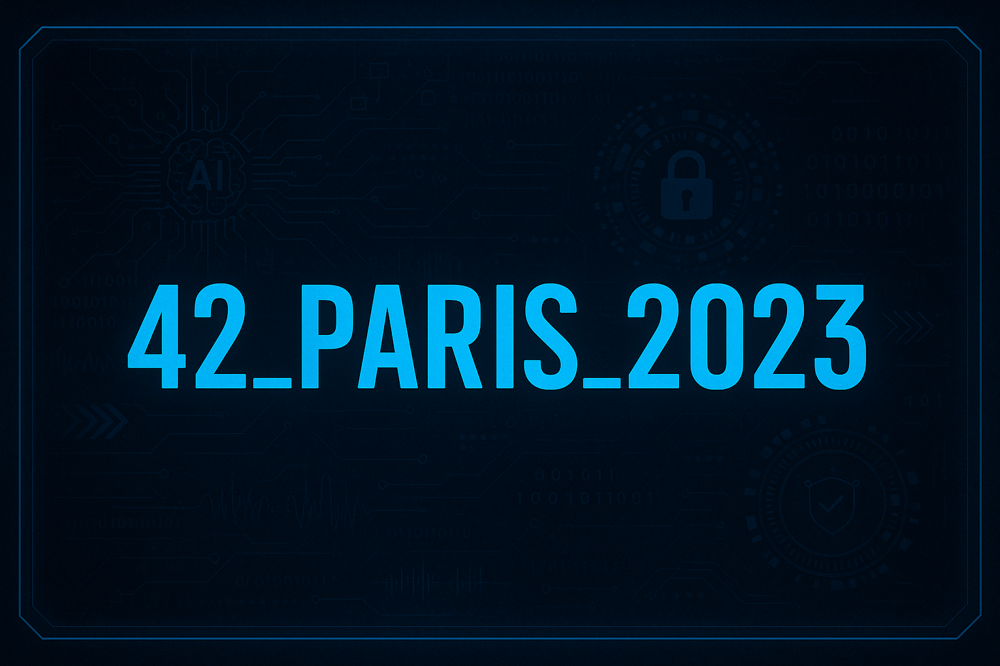

  

---

The **42_Paris** repository is a central hub that gathers multiple cursus and personal projects developed at the **42 Paris School of Programming**. It is organized into three main sections:  
- **42_Paris_2017**  
- **42_Paris_2023**  
- **Others**

This structure allows a clear separation between different cursus generations and additional personal work. Each section contains exercises, projects, and resources reflecting the student journey at 42.

---

## 1. 42_Paris_2017

This folder contains the projects and materials from the **2017 cursus and Piscine** at 42. It includes foundational programming assignments, beginner exercises, and early-stage projects. The structure highlights the initial coding journey of a 42 student, from basic C projects to more advanced exercises, gradually building programming expertise.

Main content includes:
- Introductory exercises in C programming.  
- Pool challenges (short intensive projects designed for beginners).  
- Early cursus projects that establish the 42 methodology of peer-to-peer learning and self-driven exploration.  

This section is particularly useful for tracing the origins of the 42 training and observing the progression from novice to intermediate coding challenges.

---

## 2. 42_Paris_2023

This folder covers the **2023 cursus and Piscine** at 42. It represents a more modern and updated set of projects, aligned with the latest 42 curriculum. Compared to 2017, this section contains more refined, larger-scale projects and reflects current standards in programming and system design.

Main content includes:
- Core projects in C and C++, including algorithmic challenges.  
- Docker, system administration, and virtualization projects.  
- Group projects that simulate real-world collaboration (e.g., web development, networking, and containerization).  
- Specialized projects like **Inception**, **ft_transcendence**, or advanced C++ modules.  

This section provides insight into the current state of the 42 cursus and highlights the evolution of its teaching philosophy over time.

---

## 3. Others

The **Others** folder gathers **personal projects** and experiments carried out at 42, outside the strict cursus requirements. It serves as a sandbox where custom scripts, utilities, and extra learning exercises are stored.

Main content includes:
- Personal automation scripts (e.g., helper commands, custom tooling).  
- Experimental projects that go beyond the official 42 curriculum.  
- Supplementary learning material and resources created during the cursus.  

This section showcases creativity, independence, and the extension of official training into personal exploration, embodying the spirit of continuous self-learning.

---

  
<strong>Choose a folder</strong>

  

---

[Others](https://github.com/M1000-93/42_Paris/tree/master/Others)  

---

 

